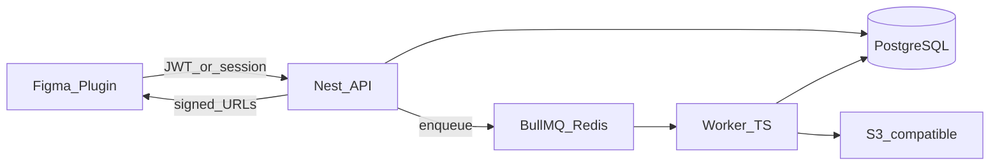

# Guia de implementação — Insta2Figma

Este guia **desdobra** o [roadmap (secção 13)](./ARQUITETURA-INSTA2FIGMA.md#13-roadmap-de-implementação-ordem-sugerida-para-llms), o **modelo de dados (secção 6)** e as **regras transversais** de [ARQUITETURA-INSTA2FIGMA.md](./ARQUITETURA-INSTA2FIGMA.md) em **8 fases** com tarefas e critérios de conclusão. Decisões estruturais (fila obrigatória em produção, monorepo, stack) ficam sempre na arquitetura; aqui apenas a execução ordenada.

## Progresso rápido

- [x] **Fase 1** — Monorepo (`pnpm` + Turborepo), `packages/shared-contracts`, `apps/figma-plugin` a partir do template legado
- [x] **Fase 2** — PostgreSQL + migrations (`users`, `jobs`, `assets` opcional)
- [x] **Fase 3** — API NestJS MVP: `POST/GET /v1/jobs` **só DB, sem fila** (temporário; JWT `register`/`login`)
- [x] **Fase 4** — Redis + BullMQ na API + `apps/worker` com scrape **simulado**
- [x] **Fase 5** — Scrape Instagram real (`InstagramDataSource`, erros classificados)
- [x] **Fase 6** — MinIO/S3-compat, uploads worker, presign API e plugin (`polling`, thumbnails no canvas)
- [x] **Fase 7** — Polar.sh + quotas atómicas + `GET /v1/me` + auth Figma + plugin billing
- [ ] **Fase 8** — CORS, rate limits, observabilidade, DLQ + [checklist secção 14](./ARQUITETURA-INSTA2FIGMA.md#14-checklist-anti-padrões-llms-devem-evitar)

## Onboarding DX (estado atual)

Foi adicionado `pnpm bootstrap` na raiz para reduzir fricção de novos devs:

- cria `.env` da API/worker quando ausentes,
- instala dependências,
- sobe Docker (`postgres`, `redis`, `minio`),
- gera Prisma client,
- aplica migrations e smoke test.

Objetivo: trazer o repositório para estado funcional com um único comando.

---

**Estado actual (após Fase 7):** Billing via [Polar.sh](https://polar.sh/docs/integrate/sdk/adapters/express): checkout/portal autenticados, webhooks `customer.state_changed`, tiers Free/Pro com quotas em `POST /v1/jobs`. Plugin: auth por `figma.currentUser`, JWT em `clientStorage`, banner de plano e CTA upgrade. **Próximo:** Fase 8 (CORS, rate limits, observabilidade).

**Princípios transversais:** separação API / trabalho pesado; fila persistente (**BullMQ**, não apenas `Promise`/`setImmediate` em produção); contratos explícitos em `packages/shared-contracts`; secrets só no servidor; idempotência em billing/quota; preferir URLs assinadas para media ([secção 2](./ARQUITETURA-INSTA2FIGMA.md#2-princípios-arquiteturais-obrigatórios)).

---

## Fase 1 — Fundação do monorepo e contratos

**Objetivo:** estrutura normativa ([secção 4.2](./ARQUITETURA-INSTA2FIGMA.md#42-layout-de-pastas-normativo)), builds repetíveis, um único package de tipos.

- Inicializar **pnpm workspaces** na raiz + **Turborepo** (`build`, `lint`, `test` com cache entre pacotes).
- Criar `packages/shared-config` (opcional mas recomendado): `tsconfig` base, ESLint partilhado.
- Criar `packages/shared-contracts`: schemas Zod (ou equivalente) para `JobType`, estados `JobStatus`, payloads `POST /v1/jobs`, envelope `{ data, error }`, erros sanitizados; exportar tipos inferidos para API, worker e plugin.
- Migrar/converter o plugin existente para [`apps/figma-plugin`](../apps/figma-plugin) (novo caminho conforme layout): garantir build para `dist/` + `manifest.json` apontando a `main`/`ui` publicados ([secção 4.4](./ARQUITETURA-INSTA2FIGMA.md#44-build-do-plugin-figma)); documentar import no README (“Import plugin from manifest” → `apps/figma-plugin/dist/manifest.json`).
- `.gitignore`/CI: pipeline que produz zip do plugin sem cópias manuais de fonte.

**Critério de conclusão:** `pnpm turbo build` (ou comando equivalente) compila contracts + plugin `dist`; sem código duplicado de DTO entre apps.

---

## Fase 2 — PostgreSQL, migrations e modelo mínimo

**Objetivo:** persistência conforme [secção 6](./ARQUITETURA-INSTA2FIGMA.md#6-modelo-de-domínio-e-dados-mínimo-normativo).

- Escolher **uma** ferramenta (Prisma *ou* Drizzle) e registar no README da API ([secção 5.2](./ARQUITETURA-INSTA2FIGMA.md#52-base-de-dados-postgresql)).
- Migrations para: `users` (UUID, `email` único se aplicável, `stripe_customer_id`, `plan_tier`, timestamps).
- `jobs` (`id`, `user_id`, `type`, `input` JSON validado no app, `status`, `result_summary`, storage refs, erros sanitizados, `idempotency_key` opcional, timestamps; índices `(user_id, created_at)`, `(status, created_at)`).
- Tabela opcional mas recomendada: `assets` (`job_id`, `content_type`, `storage_key`, `byte_size`, `expires_at`).

**Critério de conclusão:** DB sobe via `docker-compose` ou doc clara + migrations aplicáveis localmente.

---

## Fase 3 — API NestJS (MVP) + jobs sem fila (só desenvolvimento)

**Objetivo:** validar fluxo HTTP e modelo antes do Redis; explicitamente **temporário** ([secção 13, item 3](./ARQUITETURA-INSTA2FIGMA.md#13-roadmap-de-implementação-ordem-sugerida-para-llms)).

- Criar `apps/api` NestJS com módulos conceituais: `Health`, `Auth` (stub ou MVP), `Users`, `Jobs`, `Billing` (vazio inicial), `Queue` (posterior produtor).
- Auth MVP alinhado à [secção 5.8](./ARQUITETURA-INSTA2FIGMA.md#58-autenticação-recomendação-forte): fluxo browser/device OIDC ou API keys para testes — sem “login com password” improvisado sem avaliação.
- Implementar apenas em **branch/local** ou *feature flag*: `POST /v1/jobs` e `GET /v1/jobs/:id` que escrevem/lêem DB **sem** enfileirar (para testes de contrato).
- Validação DTO (whitelist/forbid onde aplicável), prefixo **`/v1/`** obrigatório ([secção 7.3](./ARQUITETURA-INSTA2FIGMA.md#73-versionamento)).

**Critério de conclusão:** plugin ou HTTP client pode criar/consultar job contra API local usando contratos partilhados.

---

## Fase 4 — Redis + BullMQ + worker (simulação)

**Objetivo:** assincronismo real ([secções 5.3, 8.1–8.2](./ARQUITETURA-INSTA2FIGMA.md#53-fila-redis--bullmq)).

- API: substituir o caminho síncrono por transação que cria `jobs` como `queued` + `queue.add('scrape-instagram-v1', { jobId })` com `attempts`/`backoff`.
- Resposta rápida: padronizar `202`/`201` + `{ jobId, status }` num único estilo ([secção 8.1](./ARQUITETURA-INSTA2FIGMA.md#81-criar-job-de-scrape)).
- `apps/worker`: consumidor BullMQ; carregar job por UUID de negócio; idempotência se já não estiver `queued`; atualizar `running`/`succeeded`/`failed` + timestamps; **simular** scrape (sem Instagram ainda).

**Critério de conclusão:** fluxo ponta-a-ponta: POST job → estado avança no DB via worker → GET reflete resultado simulado.

---

## Fase 5 — Scrape Instagram real no worker

**Objetivo:** [secção 9](./ARQUITETURA-INSTA2FIGMA.md#9-lógica-de-scrape-instagram--política-de-implementação).

- Introduzir interface `InstagramDataSource` isolando HTTP/parse para permitir troca futura da implementação.
- Timeouts explícitos, concorrência limitada por worker, classificação de erro (`retryable` vs não), logs com `jobId`.
- Mapear falhas para códigos de cliente sanitizados (ex.: `IG_RATE_LIMIT`, `IG_NOT_FOUND`, `INTERNAL`).

**Critério de conclusão:** jobs `succeeded`/`failed` com metadados reais; retries BullMQ coerentes com classificação (sem retry ilimitado sem backoff — [checklist](./ARQUITETURA-INSTA2FIGMA.md#14-checklist-anti-padrões-llms-devem-evitar)).

---

## Fase 6 — Object storage e integração no plugin

**Objetivo:** [secções 5.5, 7, 8.3](./ARQUITETURA-INSTA2FIGMA.md#55-object-storage-s3-compatible-r2-s3-minio).

- Worker: upload de media para S3-compatível (R2/S3/MinIO); persistir `assets` e prefixos/IDs em `jobs`.
- API ou serviço dedicado: geração de **URLs assinadas** com TTL definido; política de lifecycle/retenção documentada ([RGPD onde aplicável](./ARQUITETURA-INSTA2FIGMA.md#10-segurança-e-compliance)).
- Plugin: `fetch` apenas para domínios listados em `manifest.json`; polling com backoff modesto sobre `GET /v1/jobs/:id`; inserção de imagens/layouts no Figma a partir das URLs devolvidas.

**Critério de conclusão:** utilizador obtém resultado visual no canvas a partir de jobs concluídos.

---

## Fase 7 — Billing Polar.sh e quotas atómicas

**Objetivo:** [secções 5.6, 6.3, 8.4](./ARQUITETURA-INSTA2FIGMA.md#56-pagamentos-stripe) (implementado com **Polar** em vez de Stripe).

- Módulo `billing/`: `@polar-sh/sdk` (checkout/portal sessions) + `@polar-sh/express` (webhooks com raw body em `main.ts`).
- Prisma: `polar_customer_id`, `figma_user_id`, `subscriptions`, `usage_counters`, `webhook_events`.
- `POST /v1/auth/figma` — utilizador único por `figma.currentUser.id`.
- `GET /v1/me` — plano e quotas para o plugin.
- `POST /v1/billing/checkout-session` e `portal-session` — URLs para `figma.openExternal`.
- Webhook `POST /v1/billing/webhooks/polar` — `customer.state_changed` / subscrições → `plan_tier`.
- Em `POST /v1/jobs`: transação `usage_counters` + `jobs`; erro `402` com código `QUOTA_EXCEEDED`.

**Critério de conclusão:** quota bloqueia criação de job quando esgotada; Polar atualiza `plan_tier` de forma idempotente em replays de webhook.

---

## Fase 8 — Segurança, observabilidade e hardening

**Objetivo:** [secções 10–12](./ARQUITETURA-INSTA2FIGMA.md#10-segurança-e-compliance) + fecho da roadmap.

- CORS restrito; rate limit por `user_id` e IP (Throttler ou gateway).
- Logs estruturados com `jobId`, `userId`, `correlationId`; sanitizar tokens.
- Métricas mínimas: latência média de job, taxa de falha por `error_code`, profundidade da fila; opcional OTel ([secção 11](./ARQUITETURA-INSTA2FIGMA.md#11-observabilidade)).
- Dead-letter / fila falhados BullMQ; revisão final contra [checklist secção 14](./ARQUITETURA-INSTA2FIGMA.md#14-checklist-anti-padrões-llms-devem-evitar).

**Critério de conclusão:** ambiente de staging com `.env.example` completo por app ([secção 12](./ARQUITETURA-INSTA2FIGMA.md#12-ambientes-e-configuração)).

---

## Ordem recomendada e dependências

| Fase | Depende de |
|------|------------|
| 1 | — |
| 2 | 1 (contracts ajudam a modelar JSON `input`) |
| 3 | 2 |
| 4 | 3 (substituindo caminho dev sem fila) |
| 5 | 4 |
| 6 | 5 |
| 7 | 2, 4 (billing acoplado à criação de job na API) |
| 8 | 7 (ou paralelo tardio desde a Fase 4) |

O projeto pode pausar ao fim de qualquer fase (por exemplo MVP “jobs + fila + resultado simulado” após a Fase 4).
