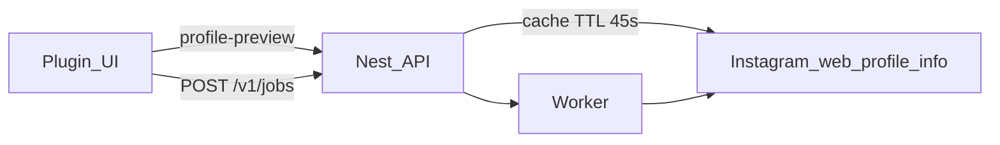

# Guia de implementação — Import por posição

Este guia desdobra a funcionalidade de **seleção por posição na timeline** (post único, intervalo e preview híbrido indexado) em **5 fases**, no mesmo estilo de [IMPLEMENTATION.md](./IMPLEMENTATION.md).

## Progresso rápido

- [x] **Fase 1** — Contratos em `packages/shared-contracts` (`selectionMode`, `startIndex`, `postCount`, `timelineOrder`) + utilitários `resolveScrapeSelection` / `slicePostsBySelection`
- [x] **Fase 2** — Worker: scrape por índice sobre `web_profile_info` (sem paginação extra no MVP)
- [x] **Fase 3** — API: preview indexado, validação por plano, cache TTL curto
- [x] **Fase 4** — Plugin Figma: UI híbrida (lista leve + thumbnail on-demand) e modos recent/single/range
- [x] **Fase 5** — Guardrails de rate limit (debounce UI, cache API, aviso de janela indisponível)

**Próximo (fora do MVP):** paginação profunda (posts #51+) com backoff e janelas navegáveis.

---

## Objetivo

Permitir importar posts por posição na timeline (ex.: só o **#10**, ou **#10–#14**), com preview indexado para o utilizador saber o que está a escolher — **sem multiplicar chamadas ao Instagram** no fluxo normal.

## Princípios

- **Uma chamada IG por preview/import** no MVP (`web_profile_info`).
- **Preview híbrido:** lista indexada primeiro; thumbnail só ao hover/focus.
- **Compatibilidade:** omissão de campos novos = modo `recent` (comportamento anterior).
- **Limites por plano:** posição final e `fetchCount` não podem exceder `quotas.maxPosts`.

---

## Fase 1 — Contratos e utilitários partilhados

**Objetivo:** tipos únicos para API, worker e plugin.

- Campos em `scrapeProfileInputSchema`: `selectionMode`, `startIndex`, `postCount`, `timelineOrder`.
- `packages/shared-contracts/src/post-selection.ts`: `resolveScrapeSelection`, `slicePostsBySelection`, `estimateImportImages`.
- `packages/shared-contracts/src/instagram-timeline-parse.ts`: parse partilhado da timeline IG.

**Critério de conclusão:** `pnpm --filter @insta2figma/shared-contracts test` passa; jobs antigos sem campos novos continuam válidos.

---

## Fase 2 — Worker (seleção por índice)

**Objetivo:** import respeitar posição escolhida.

- `buildScrapeSummaryV5FromUserNode` aplica `fetchCount` + fatia por índice.
- `scrape-runner` grava `scrapingMeta` estendido (`selectionMode`, `startIndex`, `postCount`, `fetchCount`).
- Modos:
  - `recent`: posts 1..N (legado)
  - `single`: post em `startIndex`
  - `range`: `startIndex` .. `startIndex + postCount - 1`

**Critério de conclusão:** job com `selectionMode: single`, `startIndex: 10` devolve 1 post na amostra (quando IG devolve ≥10 edges).

---

## Fase 3 — API (preview indexado + plano)

**Objetivo:** preview útil para escolher posição sem job.

- `GET /v1/instagram/profile-preview` aceita parâmetros de seleção + `previewListSize`.
- Resposta inclui `postsPreview[]` (index, shortcode, thumbnailUrl, carouselCount) e `selectionWarning` se posição pedida > posts visíveis.
- Cache em memória (~45s) por `(username, fetchCount, timelineOrder)`.
- `PlanService.assertCanCreateJob` valida `endIndex` e `fetchCount` vs limite do plano.

**Critério de conclusão:** preview devolve lista indexada; import bloqueado com mensagem clara se posição excede plano.

---

## Fase 4 — Plugin (UI híbrida)

**Objetivo:** UX para escolher o 10º post com confiança.

- `PostPreviewList`: lista `#1, #2, …` com placeholder; thumbnail lazy on hover.
- `ImportScreen`: modos recent / single / range + ordem da timeline.
- Clicar num item define `startIndex` (e muda para single se estava em recent).
- `code.ts` propaga novos campos para API e jobs.

**Critério de conclusão:** utilizador vê lista, clica `#10`, importa só esse post.

---

## Fase 5 — Guardrails de rate limit

**Objetivo:** minimizar risco de 429.

- Debounce de preview na UI (~420ms) — já existente, agora inclui params de seleção.
- Cache API (evita refetch ao mudar só estimativa dentro da mesma janela IG).
- Sem download em massa de thumbnails no primeiro render.
- Mensagens orientadas: `selectionWarning`, 429 no preview com texto acionável.

**Critério de conclusão:** alterar `startIndex` após preview carregado não dispara nova chamada IG (dentro do TTL/cache).

---

## Ordem e dependências

| Fase | Depende de |
|------|------------|
| 1 | — |
| 2 | 1 |
| 3 | 1 |
| 4 | 3 |
| 5 | 3, 4 |

---

## Limitações conhecidas (MVP)

- `web_profile_info` devolve tipicamente **até ~12 edges** (máx. 50 no código); post #120 exige **paginação futura**.
- Thumbnails lazy podem falhar no iframe do Figma (CDN IG); shortcode/index continuam visíveis.
- Ordem `oldest_first` inverte apenas a amostra já obtida, não o arquivo completo do perfil.
