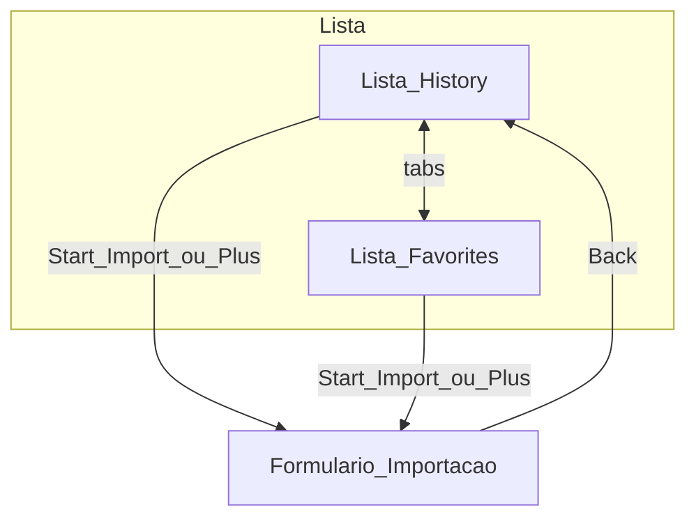

# Insta2Figma — Especificação de UI do plugin Figma

Documento de produto/UI derivado dos ecrãs exportados no Figma. Define ecrãs, estados, fluxos, regras de negócio, dependências de API e checklist de QA. Serve de referência para implementação da camada UI (React + Vite).

---

## Contexto técnico (repositório)

- **Sandbox UI vs main thread:** continuação do padrão actual `parent.postMessage` / `figma.ui.postMessage` (`import-profile`, `import-done`, `import-error`, `import-status`, `cancel`).
- **Implementação recomendada da UI:** ver secção «Stack».

---

## Stack de implementação da UI

- **React** para componentização, estado local e navegação entre **lista** (History / Favorites) e **formulário de importação**.
- **Vite** para bundling em **HTML / CSS / JS estáticos** (sem Next.js, sem SSR no runtime do iframe do plugin).
- **Build:** o pipeline do pacote `@insta2figma/figma-plugin` gera `dist/ui.html`, `dist/assets/*` (hashed) e `dist/code.js`. O campo [`ui`](apps/figma-plugin/manifest.json) do manifest mantém **`"ui": "ui.html"`**. Os paths dos assets devem ser **relativos** (`base: './'` no Vite) para funcionar no sandbox do Figma.
- **`code.ts`:** permanece compilado separadamente (esbuild); apenas a superfície `__html__` passada a `figma.showUI` reflecte o `ui.html` gerado pelo Vite.

---

## 1. Princípios globais (chrome comum)

- **Painel:** janela vertical típica de plugin Figma, fundo branco, separadores horizontais discretos (cinza claro) entre blocos funcionais.
- **Cabeçalho:**
  - Esquerda: ícone quadrado com gradiente estilo Instagram (roxo/rosa/laranja) + círculo branco tipo lente/câmara.
  - Título **Insta2Figma** (sans-serif, hierarquia clara sobre o subtítulo/contexto da secção).
  - Direita: **X** fecha o plugin (= mensagem equivalente ao fluxo cancelar já existente).
- **Cores e hierarquia:** texto principal escuro; texto secundário cinza médio; **azul vivo** como cor primária de acção («Start Import», «Import N Images»); botão primário **desabilitado** em cinza sólido, claramente distinto do activo.
- **Rodapé de vistas com acções:** botões alinhados à direita; secundário «Close» contourado; primário preenchido.

---

## 2. Fluxo navegacional (macro)

Existem dois patamares:

1. **Lista (landing):** separadores **History** | **Favorites**, campo de pesquisa, lista de contas (@handle, avatar, favorito), CTA inferior **«Start Import»**.
2. **Importar (configuração):** navegação **«‹ Back»** abaixo do header global; três blocos de formulário («What Instagram?», «Import how many posts?», «Preferences»); rodapé «Close» + «Import» ou «Import N Images».

**Regra de navegação:** **Back** regressa à lista preservando **a tab activa** (History ou Favorites) e, se possível, **texto de pesquisa** e **scroll** da lista.

---

## 3. Ecrã — Lista: tab «History» com itens

**Ordem vertical:**

1. Header global (secção 1).
2. **Barra de tabs:** **History** activo (contraste forte); **Favorites** inactivo. Na **mesma linha**, extremo direito: ícone **+** para iniciar fluxo equivalente ao CTA inferior (nova importação sem conta pré‑seleccionada, ou igual a «Start Import» conforme produto mantiver simples na v1).
3. Separador.
4. **Pesquisa:** ícone lupa à esquerda, placeholder «Search». Filtro **apenas cliente** sobre `username`/`@username` (substring, case insensitive).
5. Separador.
6. **Lista scrollável:** cada linha:
   - Avatar circular,
   - handle **`@username`** ao centro,
   - **estrela** à direita (preenchida = favorito; contorno = não favorito).
7. Separador.
8. **Rodapé:** botão **«Start Import»** (primário azul).

**Regras de produto (lista):**

- **Ordem sugerida em History:** por **última utilização / último import** (mais recente no topo).
- **Toque na linha** (área não-estrela): abre de imediato o **ecrã de importação** com **username** dessa entrada pré-preenchido (a linha pode ficar visualmente destacada como «última escolhida» ao voltar à lista). **«Start Import»** no rodapé abre o formulário com o username da última linha escolhida, se existir; caso contrário mantém o que já estava no campo. **+** abre o formulário **vazio**.
- **Estrela:** toggle de favorito; **não** abre formulário nem inicia import. Persistência: **`figma.clientStorage`** (main thread, via mensagens UI↔︎plugin); o `localStorage` do iframe do plugin **não** persiste ao fechar.

---

## 4. Ecrã — Lista: «History» vazio

- Mesmo header, tabs (History activo), **+**, campo de pesquisa.
- **Empty state centrado:** copy do tipo «Click **Start Import** … to bring Instagram to your history.» Destacar **«Start Import» / «Start to Import»** em azul **se for só ênfase visual**. **Nota UX:** texto azul sugere hyperlink; ou alinhar copy ao texto exacto do botão, ou evitar azul falsamente clicável.

**Rodapé:** **«Start Import»** igual ao modo com dados.

---

## 5. Ecrã — Lista: tab «Favorites»

- Layout idêntico ao History: **Favorites** activo; dados = subset filtrado por favorito=true.
- **Empty state próprio**, por exemplo «Ainda não tens favoritos.» + mesma entrada via **+/Start Import**.
- Pesquisa aplica‑se apenas à lista de favoritos visível.

---

## 6. Ecrã — Formulário de importação

**Entrada:** após «Start Import», «+», ou reopen a partir da lista (opcionalmente com linha seleccionada).

**Sub‑header:** **‹ Back** + separador (Back não fecha o plugin; volta à lista).

### Bloco A — «What Instagram?»

- Título forte.
- Linha com **avatar** (placeholder até validação bem-sucedida) + **campo texto** só **username**, **sem `@`** à esquerda do campo (política: normalizar entrada removendo `@` opcionalmente).
- **Estados mutualmente exclusivos** abaixo do campo:
  - **Idle:** ícone informação + *Enter only the username without '@'* (cinza).
  - **Loading:** spinner + *Searching username* (cinza).
  - **Sucesso:** ícone ✓ verde + *Username found*.
  - **Erro:** ícone alerta vermelho + mensagem clara (_Username not found_, rede, etc.).
- **Requisito obrigatório de implementação:** **verde = sucesso, vermelho = erro apenas** — corrigir qualquer inconsistência herdada dos mocks.

### Bloco B — «Import how many posts?»

- Input numérico com **ícone de galeria** à esquerda.
- Auxiliar:
  - Enquanto o perfil **não** está resolvido: *Posts will be imported chronologically*.
  - Com perfil válido: *This Instagram has **N** posts* (N em negrito).
- **Validação:** valor inteiro **≥ 1** para activar import; se > total de posts, **clamp** para o máximo com **feedback** (toast ou texto curto) — definir na implementação.

### Bloco C — «Preferences»

- Checkbox: **Export all images from carousel posts** (ortografia **carousel** no produto; mocks mostram «carrossel»).

### Rodapé do formulário

- **Close:** volta à lista sem side effects de rede (excepto cancelar requests pendentes de lookup).
- **Import (primário):**
  - **Disabled:** utilizador não resolvido, loading, erro, ou número de posts inválido/0.
  - **Enabled:** critérios satisfeitos.
  - **Label dinâmico:** usar **«Import N Images»** onde **N é o número de imagens esperadas**, não apenas o número de posts. Sem dados de carousel: pode mostrar‑se **«Import»** até existir pré‑cálculo, ou igualar posts a imagens só quando a opção carousel estiver desactivada — documentar comportamento degradado aceite na primeira entrega técnica se a API não suportar ainda pré‑visualização por post.

---

## 7. Regras de negócio — API / dados

1. **Resolução de username (debounced):** pedido ao backend para obter **avatar**, **contagem total de posts** e dados necessários para **pré‑cálculo das imagens** nos últimos **P posts** quando *carousel*=on.
2. **Pré‑cálculo de N imagens:** com *Export all carousel images* ligado e **posts = P**, N = Σ (imagens por post) nos **P posts mais recentes**. Se a API não expuser contagem por post na v1:
   - **Opção degradada:** rótulo do botão = **«Import P posts»** ou **«Import»** até o contrato estar disponível; ou estimativa conservadora (documentada como «preview pago»).
3. **Ordem de importação:** mais recentes primeiro (alinhado ao texto «chronologically» da UI como ordem cronológica do feed: clarificar como **retro‑chronological** / **newest first** na copy final).
4. **Após import bem-sucedido:** regressar à lista; **History** actualiza ou cria entrada (avatar, `@handle`, timestamp); favorito mantém‑se se já existia.

---

## 8. Matriz de estados do formulário

| Estado      | Avatar      | Linha username     | Posts | Info de posts        | Import CTA        |
|------------|-------------|--------------------|-------|----------------------|-------------------|
| Inicial    | Placeholder | Hint sem @         | 0     | Cronológico          | Disabled (cinza)  |
| A procurar | Anterior/ph | Spinner searching  | —     | Texto genérico       | Disabled          |
| Válido     | Foto        | Verde «found»      | ≥1    | Total de posts (**N**) | Enabled + label dinâmico |
| Erro       | Ph / último | Vermelho + mensagem| —    | Sem info de totais    | Disabled          |

**Casos exemplo (mocks):** `archillect`, **32** posts solicitados, **1384** no total da conta; com carousel ** ligado ⇒ **«Import 41 Images»**.

---

## 9. Integração com código actual

- O MVP em HTML único será **substituído** pela UI gerada por Vite; `manifest.json` continua com `"ui": "ui.html"` após renomeação do artefacto de build (`index.html` → `ui.html`).
- **`code.ts`:** já suporta colocação de imagens via URLs assinadas; o payload de **`import-profile`** deve evoluir para incluir (fase seguinte da feature): `postCount`, `includeCarousel`, resoluções de erro mais finas, e eventualmente progresso.
- **Tamanho da janela:** actualmente `figma.showUI(__html__, { width: 380, height: 420 })` — ajustar quando a UI final alinhar com os mocks (altura da lista + scroll).

---

## 10. Checklist de qualidade (design → código)

- Semântica de cor: sucesso verde, erro vermelho, info cinza.
- Copy coerente entre empty state e botão de rodapé.
- Ortografia **carousel** no produto.
- Estados de botão claramente legíveis (disabled vs primary).
- Hit areas: estrela vs linha (evitar toggles acidentais).
- Acessibilidade básica: foco no teclado nos inputs, `aria` em tabs se custom.

---

## 11. Backlog: avatares Instagram no histórico

**Estado actual (MVP):** após um import com sucesso, o `code.ts` lê **`profilePicUrlHd`** do `result_summary`, faz **`fetch` no main thread** com `Referer` Instagram (CDN costuma negar hotlink no `` do iframe) e envia na mensagem **`import-done`** uma string **`data:image/…;base64,…`** (fallback: URL crua). A UI guarda em **`HistoryEntry.profilePicUrl`** e [`HistoryAvatar.tsx`](../apps/figma-plugin/ui-src/components/HistoryAvatar.tsx) faz **``** com fallback para **letra**.

**Melhorias futuras (quando for prioridade):**

1. **URL mais estável:** copiar o avatar para **MinIO/S3** como no pipeline dos posts, ou servir **URLs assinadas** com TTL controlado.
2. **Resolução antes do import:** *preview* / debounce no formulário (§10) pode **pré-mostrar** foto sem esperar pelo job — hoje só actualizamos o histórico após **`import-done`**.
3. **Domínios em produção:** restringir `manifest.networkAccess` a domínios explícitos (ver `manifest.json`).

---

## Anexo A — Mapeamento ficheiros PNG → ecrã (melhor esforço)

Os ficheiros abaixo estão na **raiz do repositório** do monorepo (exportações do Figma). Ajustar esta tabela após revisão visual cruzada com o sistema de design.

| Ficheiro | Ecrã / notas |
|----------|----------------|
| [Plugin template.png](../Plugin%20template.png) | Provável vista base do chrome Insta2Figma + lista ou landing. Confirmar contra Figma source. |
| [Plugin template-1.png](../Plugin%20template-1.png) | Lista **History** com várias contas, favoritos marcados na estrela, pesquisa e **Start Import**. |
| [Plugin template-2.png](../Plugin%20template-2.png) | Lista **History** **vazia** + empty state e CTA inferior. |
| [Plugin template-3.png](../Plugin%20template-3.png) | Formulário **com** conta resolvida, totais de posts, preferência carousel, CTA tipo **«Import … Images»**. |
| [Plugin template-4.png](../Plugin%20template-4.png) | Variant do formulário: estados intermediários ou validação/error (confirmar neste ficheiro). |
| [Figma courses.png](../Figma%20courses.png) | Material relacionado ao curso / frame auxiliar — identificar uso no projeto de design antes de obrigar equivalência ao plugin. |
| [Figma courses-1.png](../Figma%20courses-1.png) | Idem; verificar layer name no Figma. |

Copias com hash no ambiente Cursor podem existir paralelamente sob `assets/` do projecto — **esta tabela refere os ficheiros versionáveis previstos na raíz do mono‑repo.**

---

## Decisões abertas (para fechar em produto)

- **Seleccção de linha vs «Start Import» já documentado** — confirmar comportamento quando há **múltiplas seleccões** ou nenhuma.
- Persistência futura de histórico/favoritos em **servidor** vs só **local**.
- Contrato HTTP exacto para **lookup + preview counts** antes de criar job de scrape completo.
- **Avatares no histórico:** ver **[secção 11](PLUGIN_UI_DESIGN_SPEC.md#11-backlog-avatares-instagram-no-histórico)** (foto de perfil real vs placeholder com letra).

---

*Última actualização: alinhado ao plano «Especificação UI Plugin» e decisão React + Vite para a UI.*
